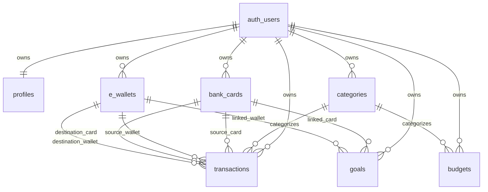

# Supabase Tables

Generated from read-only catalog inspection of the configured Supabase project on 2026-07-04.

This repository does not contain a `supabase/` directory, local SQL migrations, generated Supabase types, or checked-in database docs. The current React app also does not create a Supabase client or call any tables yet; `@supabase/supabase-js` is installed, and `src/.env` contains the Supabase connection settings.

No table row contents or secret values are included here.

## Overview

The database contains 50 non-system base tables plus one Vault view:

| Schema | Type | Count | Notes |
| --- | ---: | ---: | --- |
| `public` | base tables | 7 | Application-owned finance data. |
| `auth` | base tables | 23 | Supabase Auth internals. Do not modify directly from app code. |
| `storage` | base tables | 8 | Supabase Storage internals. Use the Storage API. |
| `realtime` | base tables | 10 | Supabase Realtime internals and message partitions. |
| `supabase_migrations` | base tables | 1 | Supabase migration bookkeeping. |
| `vault` | base tables | 1 | Vault secret storage. |
| `vault` | views | 1 | `decrypted_secrets`; avoid exposing in app code. |

## Application Tables

All application-owned tables are in the `public` schema, use UUID primary keys, and have row level security enabled. Most tables are owned per authenticated user through `user_id`, which references `auth.users(id)`.

Current row counts from aggregate `count(*)` queries:

| Table | Rows | Purpose |
| --- | ---: | --- |
| `public.bank_cards` | 8 | User bank/card accounts. |
| `public.budgets` | 8 | Per-category spending limits. |
| `public.categories` | 23 | Income and expense categories, including defaults. |
| `public.e_wallets` | 6 | User e-wallet accounts. |
| `public.goals` | 2 | Savings or finance goals. |
| `public.profiles` | 4 | User profile records paired to auth users. |
| `public.transactions` | 451 | Income, expense, withdrawal, and transfer records. |

### Relationship Summary

### `public.profiles`

Stores one profile row per Supabase Auth user.

| Column | Type | Null | Default | Notes |
| --- | --- | --- | --- | --- |
| `id` | `uuid` | no | none | Primary key; FK to `auth.users(id)` with cascade delete. |
| `full_name` | `text` | yes | none | User display name. |
| `created_at` | `timestamptz` | no | `timezone('utc', now())` | Creation timestamp. |
| `updated_at` | `timestamptz` | no | `timezone('utc', now())` | Update timestamp. No custom update trigger was found. |
| `avatar_url` | `text` | yes | none | Profile image URL. |

Constraints and indexes:

| Kind | Name | Definition |
| --- | --- | --- |
| PK | `profiles_pkey` | `PRIMARY KEY (id)` |
| FK | `profiles_id_fkey` | `id` references `auth.users(id)` on delete cascade |
| Index | `profiles_pkey` | unique btree on `id` |

RLS policy:

| Policy | Roles | Command | Predicate |
| --- | --- | --- | --- |
| `Users can manage own profile` | `authenticated` | `ALL` | `id = auth.uid()` |

### `public.bank_cards`

Stores active and inactive bank/card accounts for each user.

| Column | Type | Null | Default | Notes |
| --- | --- | --- | --- | --- |
| `id` | `uuid` | no | `gen_random_uuid()` | Primary key. |
| `user_id` | `uuid` | no | none | FK to `auth.users(id)` with cascade delete. |
| `card_name` | `text` | no | none | Display name. |
| `card_type` | `text` | no | none | Must be `credit`, `debit`, or `savings`. |
| `balance` | `numeric` | no | `0.00` | Current balance. |
| `color` | `text` | yes | none | UI color. |
| `is_active` | `boolean` | no | `true` | Soft-active flag. |
| `created_at` | `timestamptz` | no | `timezone('utc', now())` | Creation timestamp. |
| `updated_at` | `timestamptz` | no | `timezone('utc', now())` | Update timestamp. No custom update trigger was found. |
| `text_color` | `text` | yes | `#ffffff` | UI foreground color. |
| `last_four` | `text` | yes | none | Last four digits or account identifier suffix. |

Constraints and indexes:

| Kind | Name | Definition |
| --- | --- | --- |
| PK | `bank_cards_pkey` | `PRIMARY KEY (id)` |
| FK | `bank_cards_user_id_fkey` | `user_id` references `auth.users(id)` on delete cascade |
| Check | `bank_cards_card_type_check` | `card_type` in `credit`, `debit`, `savings` |
| Index | `idx_bank_cards_user_id` | btree on `user_id` |
| Index | `idx_bank_cards_user_active` | btree on `user_id` where `is_active = true` |

RLS policy:

| Policy | Roles | Command | Predicate |
| --- | --- | --- | --- |
| `Users can manage own cards` | `authenticated` | `ALL` | `user_id = auth.uid()` |

### `public.e_wallets`

Stores e-wallet accounts for each user.

| Column | Type | Null | Default | Notes |
| --- | --- | --- | --- | --- |
| `id` | `uuid` | no | `gen_random_uuid()` | Primary key. |
| `user_id` | `uuid` | no | none | FK to `auth.users(id)` with cascade delete. |
| `wallet_name` | `text` | no | none | Display name. |
| `wallet_type` | `text` | no | none | Wallet provider/type. |
| `balance` | `numeric` | no | `0.00` | Current balance. |
| `color` | `text` | yes | none | UI color. |
| `is_active` | `boolean` | no | `true` | Soft-active flag. |
| `created_at` | `timestamptz` | no | `timezone('utc', now())` | Creation timestamp. |
| `updated_at` | `timestamptz` | no | `timezone('utc', now())` | Update timestamp. No custom update trigger was found. |
| `text_color` | `text` | yes | `#ffffff` | UI foreground color. |
| `account_identifier` | `text` | yes | none | Optional account identifier. |

Constraints and indexes:

| Kind | Name | Definition |
| --- | --- | --- |
| PK | `e_wallets_pkey` | `PRIMARY KEY (id)` |
| FK | `e_wallets_user_id_fkey` | `user_id` references `auth.users(id)` on delete cascade |
| Index | `idx_e_wallets_user_id` | btree on `user_id` |
| Index | `idx_e_wallets_user_active` | btree on `user_id` where `is_active = true` |

RLS policy:

| Policy | Roles | Command | Predicate |
| --- | --- | --- | --- |
| `Users can manage own wallets` | `authenticated` | `ALL` | `user_id = auth.uid()` |

### `public.categories`

Stores transaction categories. `user_id` is nullable so default/global categories can exist alongside user-owned categories.

| Column | Type | Null | Default | Notes |
| --- | --- | --- | --- | --- |
| `id` | `uuid` | no | `gen_random_uuid()` | Primary key. |
| `user_id` | `uuid` | yes | none | Optional FK to `auth.users(id)` with cascade delete. `NULL` means default/global category. |
| `name` | `text` | no | none | Category name. |
| `type` | `text` | no | none | Must be `income` or `expense`. |
| `icon` | `text` | yes | none | UI icon identifier. |
| `color` | `text` | yes | none | UI color. |
| `is_default` | `boolean` | no | `false` | Default category marker. |
| `created_at` | `timestamptz` | no | `timezone('utc', now())` | Creation timestamp. |

Constraints and indexes:

| Kind | Name | Definition |
| --- | --- | --- |
| PK | `categories_pkey` | `PRIMARY KEY (id)` |
| FK | `categories_user_id_fkey` | `user_id` references `auth.users(id)` on delete cascade |
| Check | `categories_type_check` | `type` in `income`, `expense` |
| Index | `idx_categories_user_id` | btree on `user_id` |

RLS policies:

| Policy | Roles | Command | Predicate |
| --- | --- | --- | --- |
| `Categories: Access default or own` | `authenticated` | `SELECT` | `user_id IS NULL OR user_id = auth.uid()` |
| `Categories: Manage own categories` | `authenticated` | `ALL` | `user_id = auth.uid()` |

### `public.budgets`

Stores spending limits by user and category.

| Column | Type | Null | Default | Notes |
| --- | --- | --- | --- | --- |
| `id` | `uuid` | no | `gen_random_uuid()` | Primary key. |
| `user_id` | `uuid` | no | none | FK to `auth.users(id)` with cascade delete. |
| `category_id` | `uuid` | no | none | FK to `categories(id)` with cascade delete. |
| `limit_amount` | `numeric` | no | none | Budget limit. |
| `period` | `text` | no | `monthly` | Budget period. No database check constraint was found for allowed values. |
| `created_at` | `timestamptz` | no | `timezone('utc', now())` | Creation timestamp. |
| `updated_at` | `timestamptz` | no | `timezone('utc', now())` | Update timestamp. No custom update trigger was found. |

Constraints and indexes:

| Kind | Name | Definition |
| --- | --- | --- |
| PK | `budgets_pkey` | `PRIMARY KEY (id)` |
| FK | `budgets_user_id_fkey` | `user_id` references `auth.users(id)` on delete cascade |
| FK | `budgets_category_id_fkey` | `category_id` references `categories(id)` on delete cascade |
| Index | `idx_budgets_user_id` | btree on `user_id` |
| Index | `idx_budgets_category_id` | btree on `category_id` |

RLS policy:

| Policy | Roles | Command | Predicate |
| --- | --- | --- | --- |
| `Users can manage own budgets` | `authenticated` | `ALL` | `user_id = auth.uid()` |

### `public.goals`

Stores user financial goals, optionally linked to a card or wallet.

| Column | Type | Null | Default | Notes |
| --- | --- | --- | --- | --- |
| `id` | `uuid` | no | `gen_random_uuid()` | Primary key. |
| `user_id` | `uuid` | no | none | FK to `auth.users(id)` with cascade delete. |
| `name` | `text` | no | none | Goal name. |
| `target_amount` | `numeric` | no | none | Target amount. |
| `current_amount` | `numeric` | no | `0.00` | Current saved amount. |
| `target_date` | `date` | yes | none | Optional target date. |
| `created_at` | `timestamptz` | no | `timezone('utc', now())` | Creation timestamp. |
| `updated_at` | `timestamptz` | no | `timezone('utc', now())` | Update timestamp. No custom update trigger was found. |
| `linked_card_id` | `uuid` | yes | none | Optional FK to `bank_cards(id)` with set-null delete behavior. |
| `linked_wallet_id` | `uuid` | yes | none | Optional FK to `e_wallets(id)` with set-null delete behavior. |

Constraints and indexes:

| Kind | Name | Definition |
| --- | --- | --- |
| PK | `goals_pkey` | `PRIMARY KEY (id)` |
| FK | `goals_user_id_fkey` | `user_id` references `auth.users(id)` on delete cascade |
| FK | `goals_linked_card_id_fkey` | `linked_card_id` references `bank_cards(id)` on delete set null |
| FK | `goals_linked_wallet_id_fkey` | `linked_wallet_id` references `e_wallets(id)` on delete set null |
| Index | `idx_goals_user_id` | btree on `user_id` |

RLS policy:

| Policy | Roles | Command | Predicate |
| --- | --- | --- | --- |
| `Users can manage own goals` | `authenticated` | `ALL` | `user_id = auth.uid()` |

### `public.transactions`

Stores money movement records. A transaction can reference source card/wallet fields and destination card/wallet fields for transfers.

| Column | Type | Null | Default | Notes |
| --- | --- | --- | --- | --- |
| `id` | `uuid` | no | `gen_random_uuid()` | Primary key. |
| `user_id` | `uuid` | no | none | FK to `auth.users(id)` with cascade delete. |
| `card_id` | `uuid` | yes | none | Optional source card FK to `bank_cards(id)` with set-null delete behavior. |
| `wallet_id` | `uuid` | yes | none | Optional source wallet FK to `e_wallets(id)` with set-null delete behavior. |
| `category_id` | `uuid` | yes | none | Optional FK to `categories(id)` with set-null delete behavior. |
| `type` | `text` | no | none | Must be `income`, `expense`, `withdrawal`, or `transfer`. |
| `payment_method` | `text` | no | none | Must be `cash`, `card`, or `ewallet`. |
| `amount` | `numeric` | no | none | Transaction amount. |
| `description` | `text` | yes | none | Optional memo. |
| `transaction_date` | `date` | no | `CURRENT_DATE` | Transaction date. |
| `created_at` | `timestamptz` | no | `timezone('utc', now())` | Creation timestamp. |
| `updated_at` | `timestamptz` | no | `timezone('utc', now())` | Update timestamp. No custom update trigger was found. |
| `receipt_url` | `text` | yes | none | Optional receipt file URL. |
| `to_card_id` | `uuid` | yes | none | Optional destination card FK to `bank_cards(id)`. No delete action is specified, so the default is no action. |
| `to_wallet_id` | `uuid` | yes | none | Optional destination wallet FK to `e_wallets(id)`. No delete action is specified, so the default is no action. |

Constraints and indexes:

| Kind | Name | Definition |
| --- | --- | --- |
| PK | `transactions_pkey` | `PRIMARY KEY (id)` |
| FK | `transactions_user_id_fkey` | `user_id` references `auth.users(id)` on delete cascade |
| FK | `transactions_card_id_fkey` | `card_id` references `bank_cards(id)` on delete set null |
| FK | `transactions_wallet_id_fkey` | `wallet_id` references `e_wallets(id)` on delete set null |
| FK | `transactions_category_id_fkey` | `category_id` references `categories(id)` on delete set null |
| FK | `transactions_to_card_id_fkey` | `to_card_id` references `bank_cards(id)` |
| FK | `transactions_to_wallet_id_fkey` | `to_wallet_id` references `e_wallets(id)` |
| Check | `transactions_type_check` | `type` in `income`, `expense`, `withdrawal`, `transfer` |
| Check | `transactions_payment_method_check` | `payment_method` in `cash`, `card`, `ewallet` |
| Index | `idx_transactions_user_id` | btree on `user_id` |
| Index | `idx_transactions_user_date_created` | btree on `user_id`, `transaction_date DESC`, `created_at DESC` |
| Index | `idx_transactions_user_type` | btree on `user_id`, `type` |
| Index | `idx_transactions_card_id` | btree on `card_id` |
| Index | `idx_transactions_wallet_id` | btree on `wallet_id` |
| Index | `idx_transactions_category_id` | btree on `category_id` |

RLS policy:

| Policy | Roles | Command | Predicate |
| --- | --- | --- | --- |
| `Users can manage own transactions` | `authenticated` | `ALL` | `user_id = auth.uid()` |

## Public RLS Summary

RLS is enabled on all seven public tables.

| Table | Policy Summary |
| --- | --- |
| `profiles` | Authenticated users can manage only the profile where `id = auth.uid()`. |
| `bank_cards` | Authenticated users can manage only rows where `user_id = auth.uid()`. |
| `e_wallets` | Authenticated users can manage only rows where `user_id = auth.uid()`. |
| `categories` | Authenticated users can select default categories where `user_id IS NULL` and their own categories; they can manage only their own categories. |
| `budgets` | Authenticated users can manage only rows where `user_id = auth.uid()`. |
| `goals` | Authenticated users can manage only rows where `user_id = auth.uid()`. |
| `transactions` | Authenticated users can manage only rows where `user_id = auth.uid()`. |

## Public Trigger Summary

No custom application triggers were found in `public`. `pg_trigger` shows only internal PostgreSQL referential-integrity triggers generated by foreign key constraints.

Important consequence: columns named `updated_at` have defaults, but no database trigger was found to automatically refresh them on update.

## Supabase-Managed Tables

These schemas are owned by Supabase services. Application code should use Supabase Auth, Storage, Realtime, and Vault APIs instead of directly reading or writing these tables, except for controlled admin maintenance.

### `auth`

| Table | Approx Rows | Purpose |
| --- | ---: | --- |
| `audit_log_entries` | unknown | Auth audit events. |
| `custom_oauth_providers` | unknown | Custom OAuth provider configuration. |
| `flow_state` | 25 | Auth flow state. |
| `identities` | 5 | External identity/provider links for users. |
| `instances` | unknown | Auth instance metadata. |
| `mfa_amr_claims` | 11 | MFA authentication method reference claims. |
| `mfa_challenges` | unknown | MFA challenge state. |
| `mfa_factors` | unknown | User MFA factors. |
| `oauth_authorizations` | unknown | OAuth authorization state. |
| `oauth_client_states` | unknown | OAuth client state. |
| `oauth_clients` | unknown | OAuth client registrations. |
| `oauth_consents` | unknown | OAuth consent records. |
| `one_time_tokens` | unknown | One-time auth tokens. |
| `refresh_tokens` | 315 | Auth refresh tokens. |
| `saml_providers` | unknown | SAML provider configuration. |
| `saml_relay_states` | unknown | SAML relay state. |
| `schema_migrations` | 75 | Auth schema migration bookkeeping. |
| `sessions` | 12 | Auth sessions. |
| `sso_domains` | unknown | SSO domain configuration. |
| `sso_providers` | unknown | SSO provider configuration. |
| `users` | 4 | Supabase Auth users. |
| `webauthn_challenges` | unknown | WebAuthn challenge state. |
| `webauthn_credentials` | unknown | WebAuthn credentials. |

### `storage`

| Table | Approx Rows | Purpose |
| --- | ---: | --- |
| `buckets` | unknown | Storage bucket definitions. |
| `buckets_analytics` | unknown | Analytics bucket metadata. |
| `buckets_vectors` | unknown | Vector bucket metadata. |
| `migrations` | 57 | Storage schema migration bookkeeping. |
| `objects` | unknown | Stored object metadata. |
| `s3_multipart_uploads` | unknown | S3 multipart upload metadata. |
| `s3_multipart_uploads_parts` | unknown | S3 multipart upload part metadata. |
| `vector_indexes` | unknown | Storage vector index metadata. |

### `realtime`

| Table | Approx Rows | Purpose |
| --- | ---: | --- |
| `messages` | partitioned | Realtime message parent table. |
| `messages_2026_07_01` | unknown | Daily Realtime message partition. |
| `messages_2026_07_02` | unknown | Daily Realtime message partition. |
| `messages_2026_07_03` | unknown | Daily Realtime message partition. |
| `messages_2026_07_04` | unknown | Daily Realtime message partition. |
| `messages_2026_07_05` | unknown | Daily Realtime message partition. |
| `messages_2026_07_06` | unknown | Daily Realtime message partition. |
| `messages_2026_07_07` | unknown | Daily Realtime message partition. |
| `schema_migrations` | 68 | Realtime schema migration bookkeeping. |
| `subscription` | unknown | Realtime subscription metadata. |

### `supabase_migrations`

| Table | Approx Rows | Purpose |
| --- | ---: | --- |
| `schema_migrations` | unknown | Supabase migration tracking. |

### `vault`

| Object | Type | Purpose |
| --- | --- | --- |
| `secrets` | base table | Encrypted Vault secrets. |
| `decrypted_secrets` | view | Decrypted Vault secret view; never expose to client code. |

## Enum Types Outside `public`

No custom enum types were found in `public`. Supabase-managed schemas define these enum types:

| Schema | Enum | Values |
| --- | --- | --- |
| `auth` | `aal_level` | `aal1`, `aal2`, `aal3` |
| `auth` | `code_challenge_method` | `s256`, `plain` |
| `auth` | `factor_status` | `unverified`, `verified` |
| `auth` | `factor_type` | `totp`, `webauthn`, `phone` |
| `auth` | `oauth_authorization_status` | `pending`, `approved`, `denied`, `expired` |
| `auth` | `oauth_client_type` | `public`, `confidential` |
| `auth` | `oauth_registration_type` | `dynamic`, `manual` |
| `auth` | `oauth_response_type` | `code` |
| `auth` | `one_time_token_type` | `confirmation_token`, `reauthentication_token`, `recovery_token`, `email_change_token_new`, `email_change_token_current`, `phone_change_token` |
| `realtime` | `action` | `INSERT`, `UPDATE`, `DELETE`, `TRUNCATE`, `ERROR` |
| `realtime` | `equality_op` | `eq`, `neq`, `lt`, `lte`, `gt`, `gte`, `in`, `like`, `ilike`, `is`, `match`, `imatch`, `isdistinct` |
| `storage` | `buckettype` | `STANDARD`, `ANALYTICS`, `VECTOR` |

## Codebase Findings

The local codebase currently has no Supabase database usage:

| Area | Finding |
| --- | --- |
| `src/` | No `createClient`, `.from(...)`, `.rpc(...)`, auth, storage, or realtime calls were found. |
| `docs/` | Empty before this file was added. |
| Repository root | No `supabase/` directory, local migrations, seed files, or generated database type definitions were found. |
| Dependencies | `@supabase/supabase-js` is installed and ready to use. |

Recommended follow-up for implementation work: generate committed Supabase TypeScript types from this schema and create a single `src/lib/supabase.ts` client module before adding feature code.
